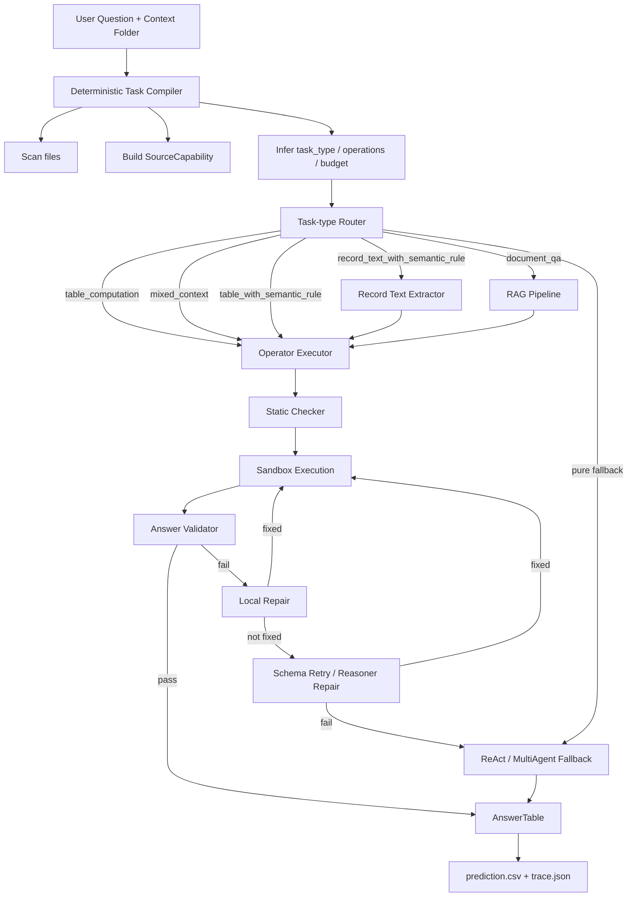
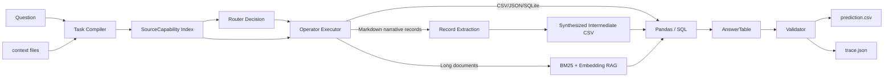
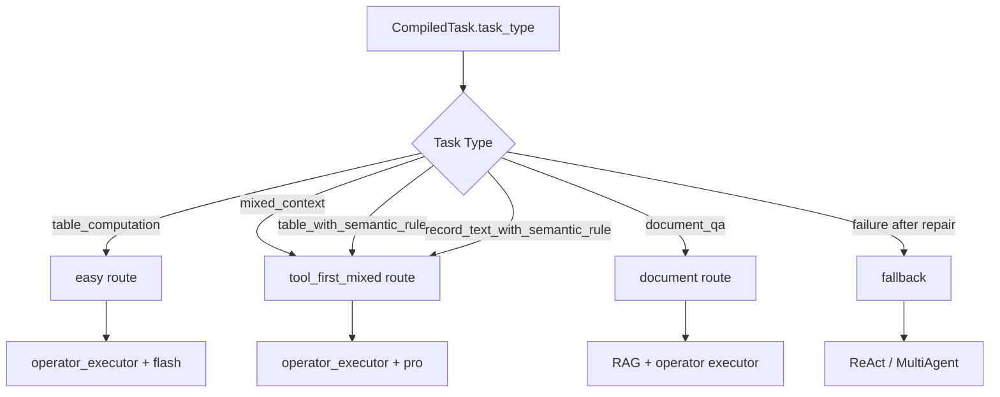
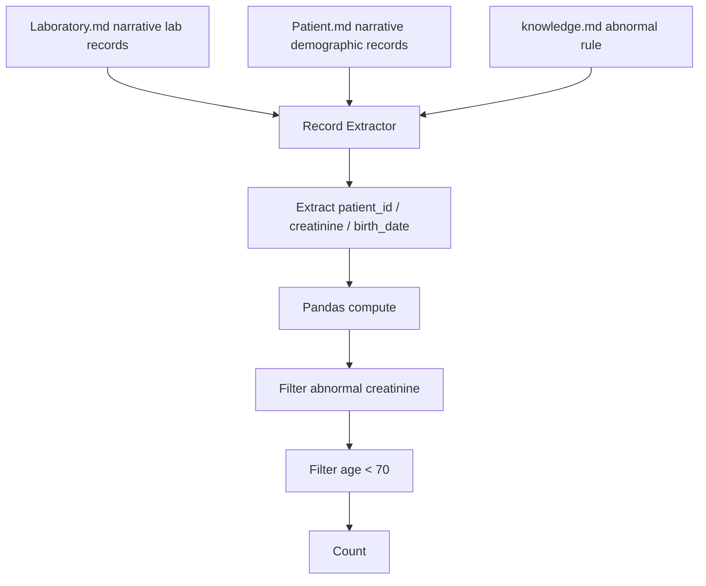

# Data Agent 项目 PPT 素材

> 主题：面向异构表格/文档上下文的 Tool-first Data Agent  
> 核心口径：**构建一个基于表格表示学习/表格智能的应用系统，不是从零训练模型。**

---

## 1. 一句话介绍

本项目实现了一个面向 DataAgent-Bench 的异构数据问答系统：系统接收自然语言问题和多源上下文（CSV、JSON、SQLite、Markdown 叙事文档等），自动识别任务类型，选择合适的数据工具执行，并通过验证、局部修复和兜底推理生成最终答案表。

---

## 2. 系统总架构图



---

## 3. 数据流动图



---

## 4. 当前路由设计



设计重点：

- `difficulty` 不再是主路由依据，只作为预算提示。
- 主路由依据是 `task_type` 和数据源形态。
- 能用 SQL/Pandas/RAG/regex 解决的任务优先走工具。
- `ReAct` 和 `MultiAgent` 不作为默认主链路，只在失败后兜底。

---

## 5. 核心模块结构

```text
src/data_agent_baseline/
├── agents/
│   ├── task_compiler.py          # 本地任务画像：文件扫描、任务类型、预算
│   ├── router.py                 # 按 task_type 分流
│   ├── operator_executor.py      # tool-first 主执行器
│   ├── tablellm_direct.py        # 代码生成与执行包装
│   ├── structured_doc_executor.py# 非结构化 record_text 抽取
│   ├── document_retriever.py     # BM25 / embedding RAG
│   ├── static_checker.py         # 本地静态检查
│   ├── local_repair.py           # 本地确定性修复
│   ├── reasoner_repair.py        # 局部 reasoner 修复
│   ├── react.py                  # ReAct 兜底路径
│   └── orchestrator.py           # MultiAgent 兜底路径
├── eval/
│   ├── answer_validator.py       # AnswerTable 合法性检查
│   └── column_match.py           # 本地 scoring
├── run/
│   └── runner.py                 # 单任务/批量任务运行
├── tools/
│   ├── filesystem.py             # read_csv/read_json/read_doc
│   ├── sqlite.py                 # SQLite 工具
│   └── python_exec.py            # sandbox python execution
├── budget.py                     # 调用预算控制
├── progress.py                   # 展示用事件流
└── cli.py                        # dabench CLI
```

---

## 6. 关键概念：SourceCapability

每个上下文文件都会被编译成一张“能力卡片”：

```text
SourceCapability
├── path
├── kind: csv / json / db / md / record_text / image
├── role: data / semantic_rule
├── tool: pandas / sql / doc_parser / rag
├── columns / tables / json fields
├── sample records
└── scan_error
```

作用：

- 让 prompt、静态检查、执行器看到同一份 schema。
- 避免模型猜错文件名、表名、字段名。
- 让本地程序可以先发现错误，再决定是否需要模型修复。

---

## 7. 例子：task_418 的正确流向

问题：

```text
Among the patients whose creatinine level is abnormal,
how many of them aren't 70 yet?
```

上下文：

```text
Laboratory.md  -> record_text
Patient.md     -> record_text
knowledge.md   -> semantic_rule
```

正确链路：



要点：

- 这不是结构化表格任务。
- 两个 `.md` 是非结构化病例叙事文本。
- 系统先抽取结构化中间结果，再进行工具计算。

---

## 8. 主要创新点

### 创新点 1：Task-type Router 替代 Difficulty Router

传统做法容易把 hard/extreme 直接送进更重的模型或 MultiAgent。  
本项目按任务类型分流：

```text
table_computation
mixed_context
table_with_semantic_rule
record_text_with_semantic_rule
document_qa
```

这样避免“难题等于多智能体”的误判。

### 创新点 2：Tool-first 执行链

系统优先使用可验证工具：

```text
SQL / Pandas / JSON parser / regex / RAG
```

LLM 主要负责代码生成、字段理解和局部修复，而不是直接猜答案。

### 创新点 3：非结构化记录文本抽取

对 `Patient.md`、`Laboratory.md` 这种叙事文档，不把它们当普通长文档，也不误判成表格，而是识别为：

```text
record_text
```

然后抽取成中间 CSV，再交给工具计算。

### 创新点 4：本地验证与局部修复

系统会在多个阶段做本地检查：

```text
Python AST parse
SQL/table/file/schema check
AnswerTable validator
numeric/string output check
```

能本地修复的错误，不重新请求模型。

### 创新点 5：Traceable Agent

每个任务输出 `trace.json`，记录：

```text
compiler decision
router decision
selected model
tool execution
repair attempts
cascade attempts
final answer
failure reason
```

这让系统适合课堂展示和错误分析。

---

## 9. 技术栈

| 层级 | 技术 |
| --- | --- |
| 语言 | Python |
| CLI / 工程 | Typer, uv |
| 表格处理 | pandas, SQLite |
| 文档处理 | Markdown/text parser, regex extraction |
| RAG | BM25 + optional embedding retrieval |
| LLM 接口 | OpenAI-compatible API |
| Agent 框架 | Router, Operator Executor, ReAct fallback, MultiAgent fallback |
| 验证 | AST static check, schema validator, AnswerTable validator |
| 评估 | DABench score-run, custom eval.py |
| 可观测性 | rich progress logger, trace.json, route audit script |

---

## 10. Demo 展示建议

### Demo 1：简单表格任务

```bash
uv run dabench run-task task_19 \
  --config configs/router.deepseek.yaml \
  --mode router \
  --stream
```

展示点：

- compiler 识别为 `table_computation`
- router 走 `easy/operator_executor`
- 工具读 CSV/JSON，输出答案

### Demo 2：混合上下文任务

```bash
uv run dabench run-task task_415 \
  --config configs/router.deepseek.yaml \
  --mode router \
  --stream
```

展示点：

- SQLite + record_text + JSON
- 先找 raceId，再查 DB，再映射 constructor JSON
- 失败时不整题重跑，优先 schema inspect / repair

### Demo 3：非结构化病例文本任务

```bash
uv run dabench run-task task_418 \
  --config configs/router.deepseek.yaml \
  --mode router \
  --stream
```

展示点：

- `Laboratory.md` / `Patient.md` 是非结构化 narrative text
- compiler 识别为 `record_text_with_semantic_rule`
- 先抽取中间记录，再工具计算

---

## 11. 和课程要求的对应

课程要求是构建一个 TRL-based application，例如 TableQA 或 NL2SQL。  
本项目满足点：

- 面向表格/半结构化/文档上下文的自然语言问答。
- 自动识别 schema、数据源和任务类型。
- 将自然语言问题转化为可执行的数据操作。
- 使用工具执行查询、筛选、聚合、连接和计算。
- 输出标准化答案表并进行评估。

因此，本项目属于：

```text
TableQA / Data Agent / NL2DataOps 应用系统
```

调用大模型 API 是实现方式，微调模型是可选增强，不是必要条件。

